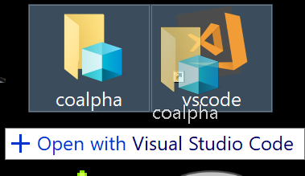

# translnk

To start programming, I like to drag the repositories that I have on my desktop
to a vscode shortcut.



When doing that, it executes something like this:

```
"C:/Program Files/vscode/Code.exe" C:/Users/Me/Desktop/coalpha
```

This workflow doesn't work for shortcut files (.lnk) since vscode opens the file itself instead of it's destination. Instead of targeting the application directly, change your shortcut to call `translnk` first. e.g:

```
translnk C:/Program Files/vscode/Code.exe
```
